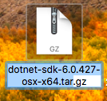

# .net_MVC_practice

This repo follows this tutorial: [Get started with ASP.NET Core MVC](https://learn.microsoft.com/en-us/aspnet/core/tutorials/first-mvc-app/start-mvc?view=aspnetcore-8.0&tabs=visual-studio-code)

# Install .NET locally in a folder 
[.NET download version](https://dotnet.microsoft.com/en-us/download/dotnet)

I wanted to install .NET locally in my folder instead of my system. The next section below details the steps.

# Mac
1. Inside your project folder, create a folder named "dotnet_files" where the .NET files will be stored
2. On the download website, click a version and then download the x64 version under "Binaries" for macOS
    * A tar.gz file will be downloaded
3. In your terminal, use "cd" to navigate to the tar.gz file's location
4. Extract the .NET SDK files into the dotnet_files folder with the following template code:

**NOTE**: Replace " dotnet-sdk-\<version>\-osx-x64" with the name of the downloaded file. For example, if the file name was the below:  

```bash
# TEMPLATE
tar -xzf dotnet-sdk-<version>-osx-x64.tar.gz -C ~/Desktop/Projects/MyApp/dotnet_files
```
```bash
# With actual file name
tar -xzf dotnet-sdk-6.0.427-osx-x64.tar.gz -C ~/Desktop/Projects/MyApp/dotnet_files
```
5. Verify the extraction
    * To check that everything extracted correctly, list the contents of the dotnet_files folder
    or simply click on the folder to see if everything is there. You should see files like dotnet (the main executable), shared, and sdk
```bash
ls ~/Desktop/Projects/MyApp/dotnet_files
```
6. Run .NET from the local installation
    * Test the setup by running the local dotnet executable

**NOTE**: You do need to actually write out the entire path to run the dotnet command, but an alias can be made to shorten it
```bash
~/Desktop/Projects/MyApp/dotnet_files/dotnet --version
```

## Create an alias (optionally, but highly recommended)
1. In the terminal...
if using bash
```bash
nano ~/.bashrc
```
if using zsh
```zsh
nano ~/.zshrc
```
2. Add the alias cmd
```bash
alias dotnet=~/Desktop/Projects/MyApp/dotnet_files/dotnet
```
3. Save and close the tile
    * To save and exit in nano:
        1. Press Ctrl + X
        2. Press Y to confirm saving the changes
        3. Press Enter to write the changes and exit
        
4. Reload the .bashrc File
```bash
source ~/.bashrc
```
5. Test the Alias
```bash
dotnet --version
```

